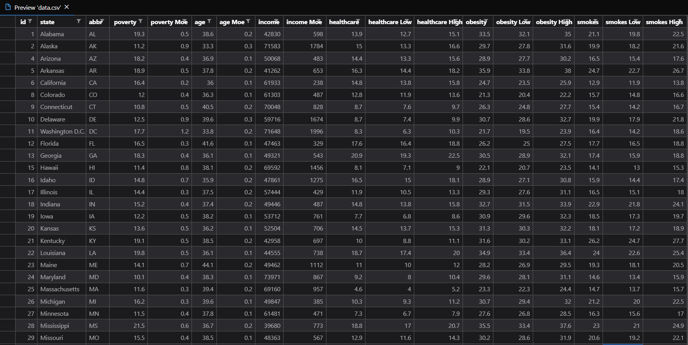
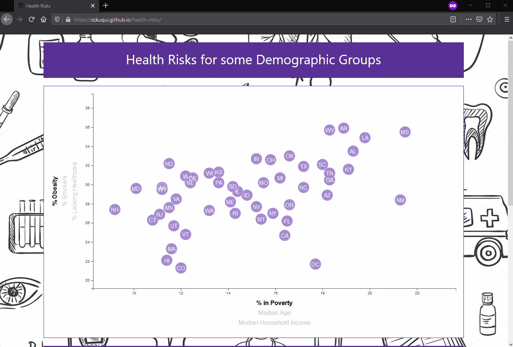

# Health Risks for some Demographic Groups

## Data

The data set is based on 2014 ACS 1-year estimates from the [U.S. Census Bureau and the Behavioral Risk Factor Surveillance System](https://factfinder.census.gov/faces/nav/jsf/pages/searchresults.xhtml). It includes data on rates of income, obesity, poverty, etc. by state. MOE stands for "margin of error."

### Objectives

* Create a scatter plot the data variables with:

  * State abbreviations in the circles.
  * Click events so that your users can decide which data to display.
  * Animated the transitions for your circles' locations.
  * Tooltips for each circles and display the data that the user has selected.

## Results

### Copyright

First image not own, retrived from [MedicineHow](https://www.medicinehow.com/heart-health-risk/) on 16/07/2020
